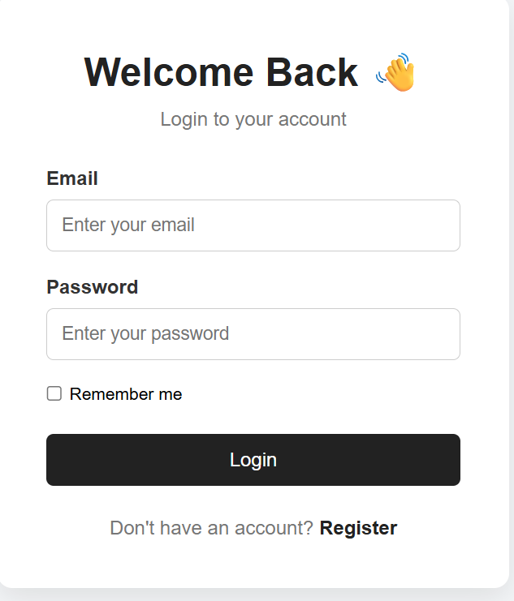
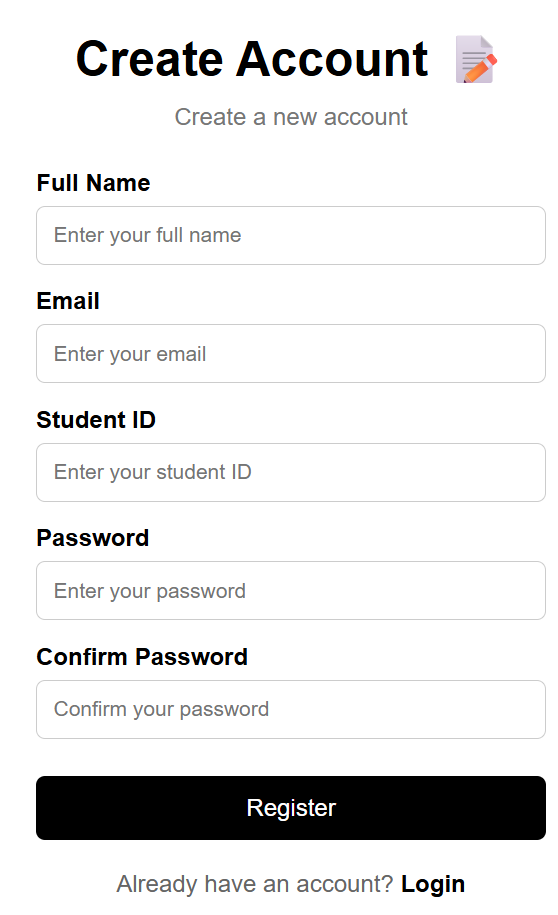
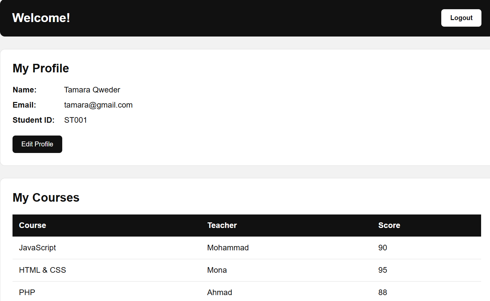

# Student Management System

A simple Student Management System built using HTML, CSS, JavaScript, and JSON Server.

## Features

- Student Login
- Student Registration
- Remember Me using Local Storage and Session Storage
- Student Dashboard
- Display student profile information
- Update student name and email
- Display enrolled courses
- Display teacher names
- Display student scores
- Logout functionality
- Data stored and managed using JSON Server API

## Technologies Used

- HTML
- CSS
- JavaScript
- JSON Server
- REST API
- Local Storage
- Session Storage

## Setup Instructions

### 1. Clone the project

```bash
git clone https://github.com/tamaraqweder/personal-edu-track.git
```

### 2. Open the project folder

```bash
cd "edu-track for me"
```

### 3. Start JSON Server

Make sure you have Node.js installed, then run:

```bash
npx.cmd json-server --watch db.json
```

The API will run on:

```text
http://localhost:3000
```

### 4. Open the project

Open `login.html` in your browser using VS Code Live Server or another local server.

## API Endpoints

### Students

```text
http://localhost:3000/students
```

### Courses

```text
http://localhost:3000/courses
```

## How the System Works

### Login

The student enters their email and password.

JavaScript sends a GET request to the Students API and checks whether the entered information matches an existing student.

If the login is successful, the student's information is saved in Local Storage or Session Storage.

### Registration

The student enters:

- Full Name
- Email
- Student ID
- Password
- Confirm Password

The system checks the entered information and sends the new student to the API using a POST request.

### Dashboard

After login, the student can see:

- Name
- Email
- Student ID
- Enrolled courses
- Teachers
- Scores

The dashboard gets the courses from the API and displays only the courses that belong to the logged-in student.

### Profile Update

The student can update their name and email.

The updated information is sent to the API using a PUT request.

### Logout

The Logout button removes the current user from Local Storage and Session Storage and redirects the student back to the Login page.

## Screenshots

### Login Page



### Registration Page



### Dashboard

